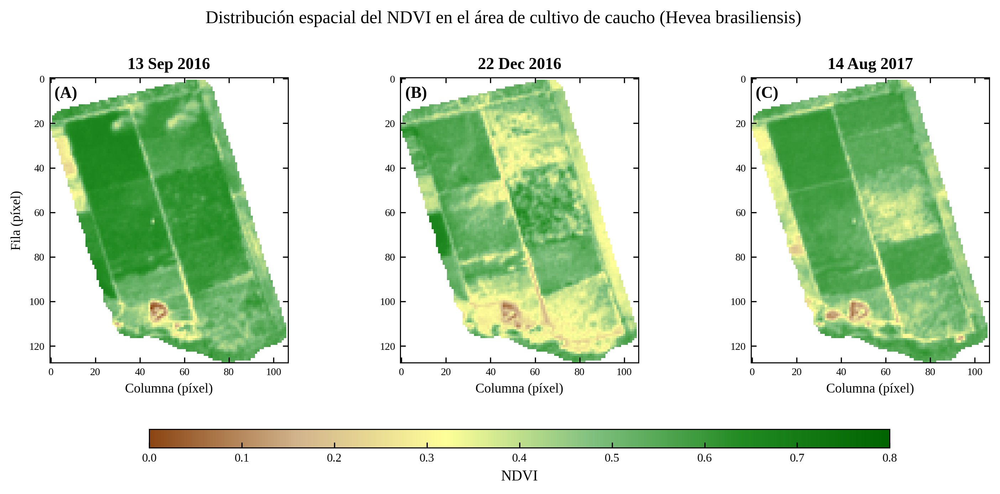
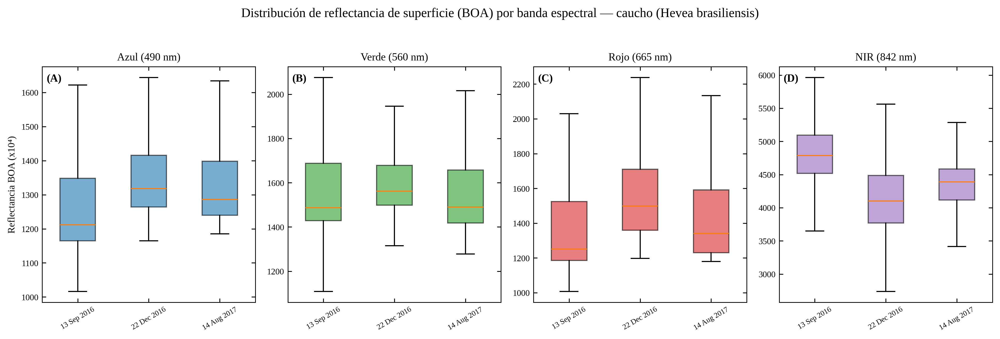
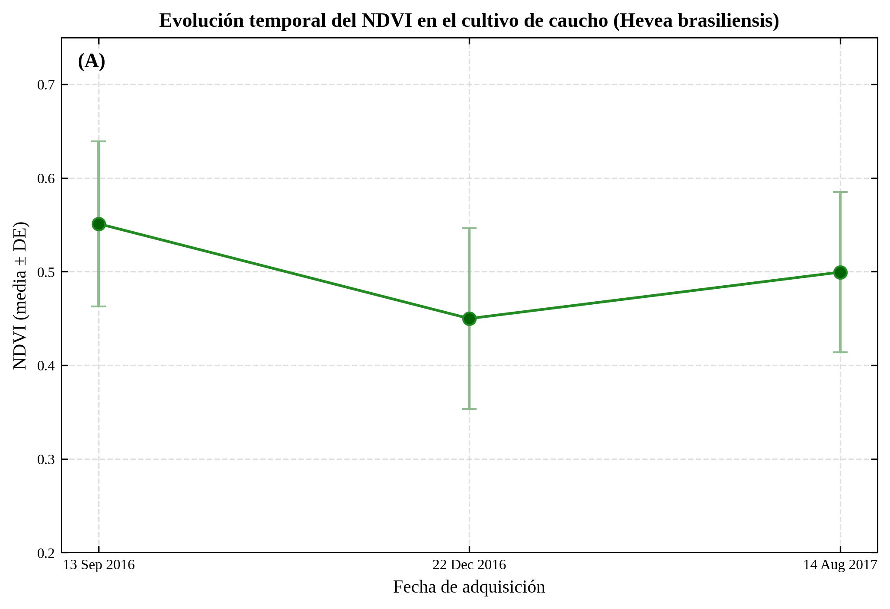
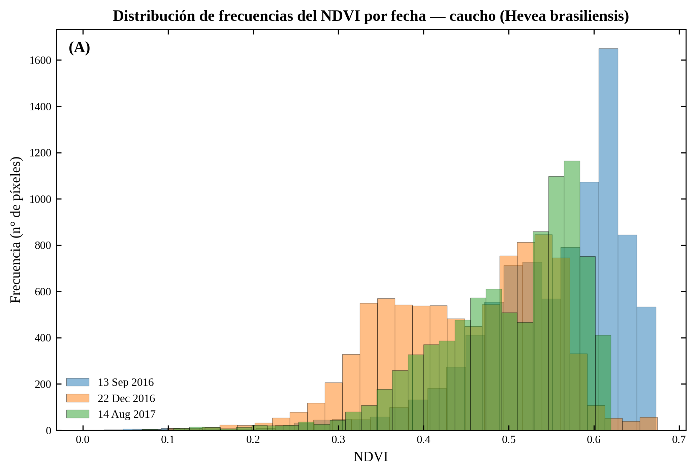
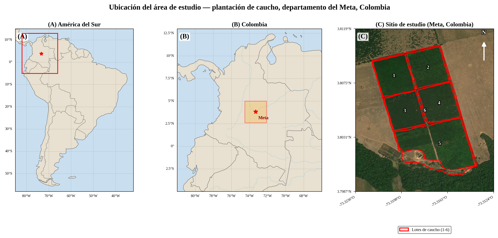
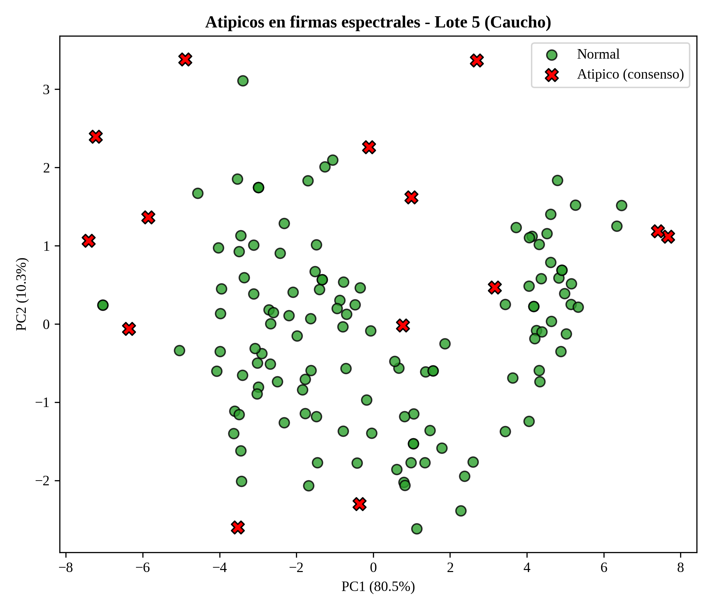

# Proyecto Final: Inteligencia Artificial y Modelos de Producción Agropecuaria

Este repositorio reúne el desarrollo del proyecto final de la asignatura **Inteligencia Artificial y Modelos de Producción Agropecuaria**. El enfoque integra fundamentos de IA, modelos de aprendizaje automático y análisis aplicado a problemas del sector agropecuario, con apoyo en cuadernos, resultados visuales y figuras generadas durante el trabajo.

## Vista general

- Presenta un proyecto aplicado con notebooks y recursos de apoyo.
- Integra conceptos vistos en clase: regresión regularizada, aprendizaje supervisado y no supervisado, y visualización de resultados.
- Incluye figuras almacenadas en subcarpetas para documentar el proceso y los hallazgos del proyecto.

## Contenido del repositorio

| Tipo de recurso | Archivos detectados |
|---|---:|
| Imágenes/figuras | 7 |
| Notebooks/Script/Datos/Markdown | 27 |

## Estructura principal

- `05_reporte_calidad.csv`
- `06_figuras_publicacion/`
- `09_indices_finca/`
- `0_AREA.py`
- `0_descargar_2_imagenes_v2.py`
- `0_descargar_imagenes_tiff_s2_revision_visual.py`
- `10_dataset_modelado_FINAL.csv`
- `10_dataset_modelado_POR_MES.csv`
- `11_dataset_LIMPIO_sin_atipicos.csv`
- `16_deteccion_atipicos/`
- `1_procesar_toa_a_boa_sen2cor_v2.py`
- `2_descargar_BOA_2017_GEE.py`
- `3_descargar_L2A_2017_local.py`
- `4_recortar_finca.py`
- `5_analisis_calidad.py`
- `6_generar_figuras_publicacion_v2.py`
- `7_mapa_ubicacion_caucho.py`
- `F1_recorte_jerarquico.py`
- `F2c_calcular_indices_v2_estructura_real.py`
- `F3_extraccion_final_3fechas.py`
- `F3_extraccion_puntos_campo.py`
- `F3c_outliers_FINAL.py`
- `F4_EDA_PCA_Clustering.py`
- `F5_F6_OPCION_A_v2.py`
- `F5_F6_Ridge_Lasso_RF_XGBoost.py`
- `F5_F6_SLOO_TUNEO_COMPLETO.py`
- `F7_extrapolacion_lotes.py`
- `lotes_gulupa.geojson`

## Figuras destacadas

### `06_figuras_publicacion/Fig1_NDVI_mapas_multitemporal.png`



### `06_figuras_publicacion/Fig2_boxplot_reflectancia.png`



### `06_figuras_publicacion/Fig3_serie_temporal_NDVI.png`



### `06_figuras_publicacion/Fig4_histograma_NDVI.png`



### `06_figuras_publicacion/FigLoc_location_map_caucho.png`



### `16_deteccion_atipicos/Fig_outliers_PCA.png`



## Metodología del proyecto

1. Exploración y organización de los datos del problema agropecuario.
2. Selección de técnicas de inteligencia artificial y aprendizaje de máquinas según el objetivo del análisis.
3. Entrenamiento, validación y comparación de modelos.
4. Interpretación de resultados mediante gráficos, métricas y figuras de apoyo.

## Herramientas utilizadas

- `pandas` y `numpy` para manejo y transformación de datos.
- `matplotlib` y/o `seaborn` para visualización.
- `scikit-learn` para modelos de machine learning.
- `Jupyter Notebook` para desarrollo reproducible del análisis.

## Cómo usar este repositorio

```bash
git clone https://github.com/jf-floresriera/Inteligencia-artificial-y-modelos-de-produccion-agropecuaria_-PROYECTO-FINAL.git
cd Inteligencia-artificial-y-modelos-de-produccion-agropecuaria_-PROYECTO-FINAL
```

Luego, abre los notebooks o revisa las carpetas del proyecto para explorar el flujo completo del análisis, las salidas gráficas y las conclusiones visuales.

## Idea de README más visual

Para que el repositorio “se vea chévere” en GitHub, este README resalta figuras reales del proyecto directamente desde sus subcarpetas. Si luego quieres una segunda versión más premium, puede añadirse: badges, tabla de métricas, GIFs, portada y una sección de resultados clave.
